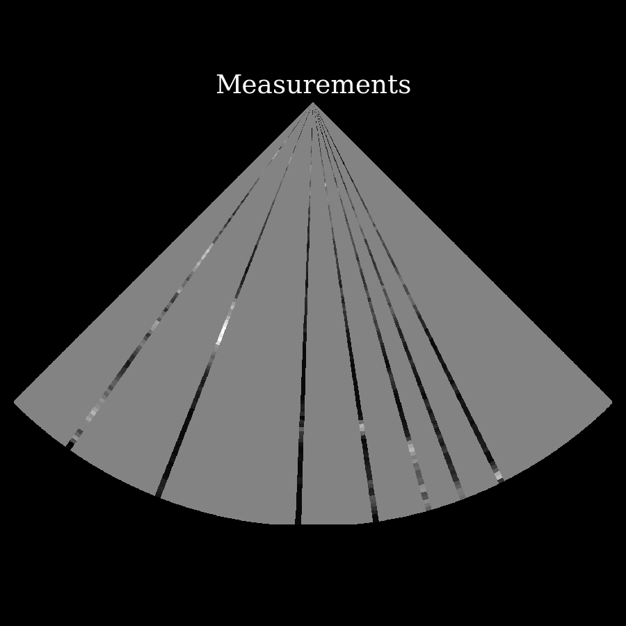
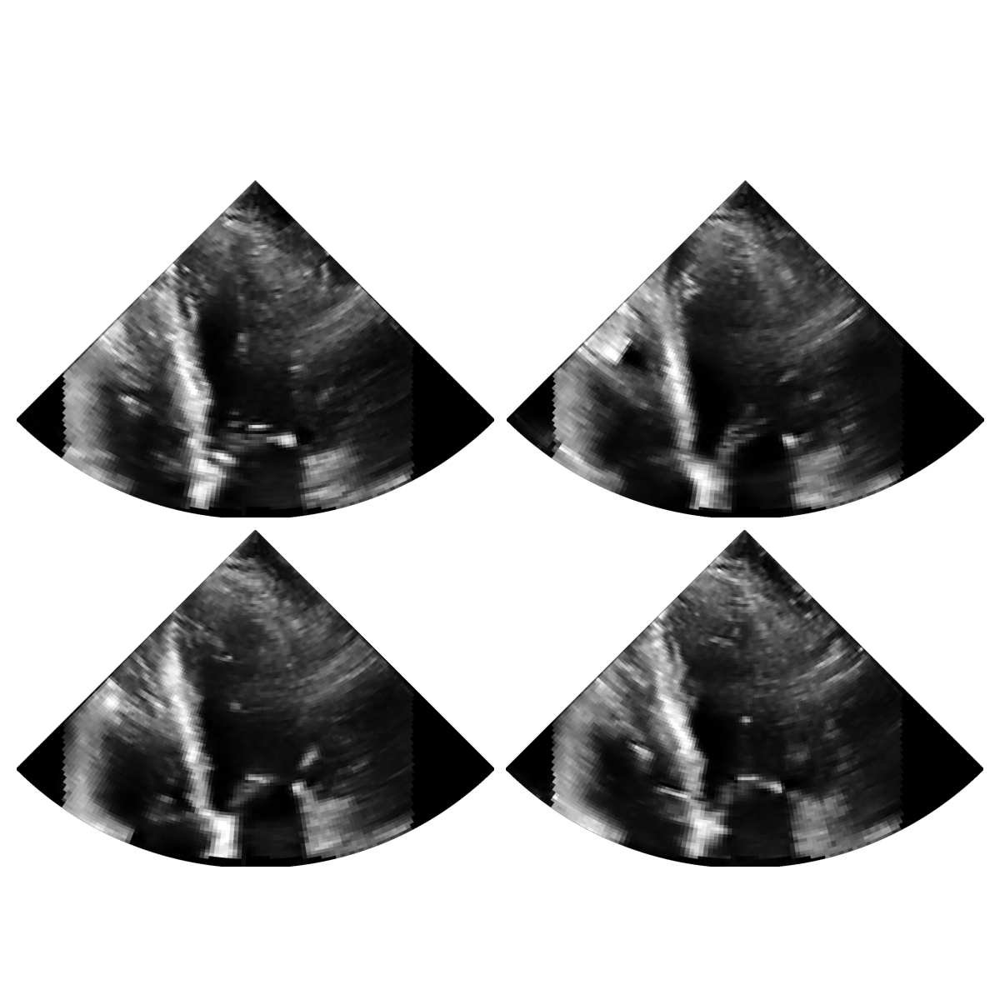
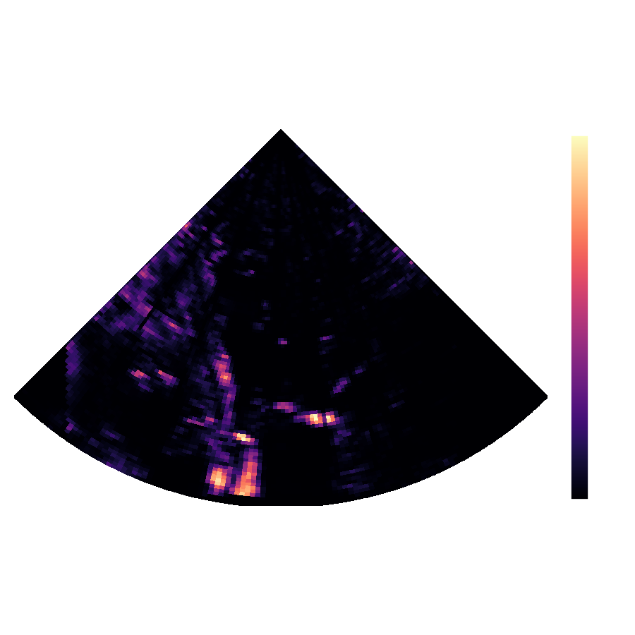

## Supplemental Visual Assets

### Sample model outputs from a single perception step.

| $\Huge y_t$ | $\Huge \\{x_t^{(i)}\\}_{i=1}^{N_p}$ | $\Huge \mathbb{V}[x_t]$  |
| :--- | :--- | :--- |
|  |  |  |

### Side-by-side video

Video comparisons of in-house dataset, acquired using tissue harmonic imaging.
From left to right: target created using 56 x 2 focused transmit events, one for each polarity,
cognitive reconstruction with 11 x 2 transmit events,
and diverging wave with 11 x 2 transmit events.

